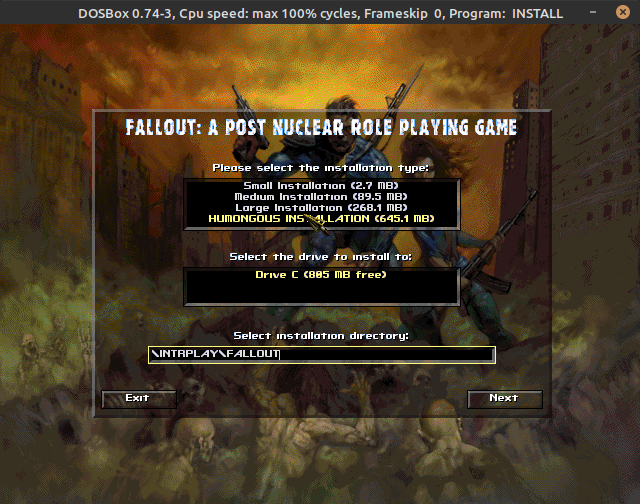
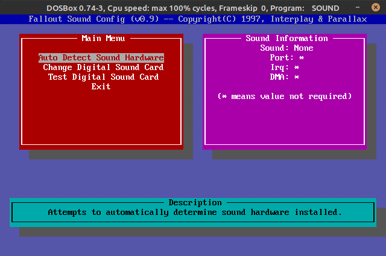

# == DEORI GAMES ==

## -- Windows --
### Instalação
Primeiro baixe o dosbox pra sua distro de linux.
Instale normalmente o dosbox no diretório padrão.

Depois crie uma pasta dentro de C: com esse exato nome: ***DosBox***

Dentro da pasta DosBox descompacte o arquivo 7z fornecido separadamente.

Para o caminho ficar assim:

```txt
C:\DosBox\
```

Agora 

A estrutura tem que ficar assim:

```txt
C:/DosBox/Fallout1
```

E Dentro da pasta Fallout1 tem que ter os arquivos:

```txt
Fallout.ISO
Scripts
Fallout1.ico
etc...
```

Agora basta entrar na pasta scripts e executar o atalho InstalarFallout1.

Irá abrir essa tela:

Selecione a opção marcada no print, **HUMONGOUS INSTALLATION (645.1 MB)**



Depois de concluída a instalação, clique em ok.
Aparecerá uma tela para configurar a placa de som:



Selecionado Auto Detect Sound Hardware, vá pressionando enter até o final, no fim o programa
irá sair automagicamente.

### Tradução
Se quiser traduzir o jogo, pegue a pasta DATA dentro de 
```sh
C:/DosBox/Fallout1/TRADUÇÃO-Fallout
```

e substitua em
```sh
C:/DosBox/Fallout1/DOS/INTRPLAY/FALLOUT.
```

Simplesmente mescle a pasta DATA da tradução com a pasta DATA do jogo.
Básico CTRL+C CTRL+V.

### Iniciando o jogo
Para iniciar o jogo pré configurado, execute o atalho **RodarFallout1** ou **RodarFallout1 - Original Screen**.
Aí vai do seu gosto e/ou por questão de performance.

## -- Linux --
### Instalação
Primeiro baixe o dosbox pra sua distro de linux.
Instale normalmente o dosbox no diretório padrão.

Depois crie uma pasta dentro de Home com esse exato nome:
DosBox
Para o caminho ficar assim:
~/home/nomedeusuario/DosBox/

Dentro da pasta DosBox descompacte o arquivo 7z fornecido separadamente.

Para o caminho ficar assim:

```sh
~/home/nomedeusuario/DosBox/Fallout1
```

E Dentro da pasta Fallout1 tem que ter os arquivos:

```txt
Fallout.ISO
Scripts
Fallout1.ico
etc...
```

Agora basta entrar na pasta scripts abrir o arquivo InstalarFallout1-Linux.conf com o dosbox.
Para isso abra o terminal e digite:

Copie o comando e cole com ctrl+shift+v

```sh
dosbox -conf ~/DosBox/Fallout1/Scripts/InstalarFallout1-Linux.conf
```

Irá abrir essa tela:

Selecione a opção marcada no print, **HUMONGOUS INSTALLATION (645.1 MB)**


Depois de concluída a instalação, clique em ok.
Aparecerá uma tela para configurar a placa de som:


Selecionado Auto Detect Sound Hardware, vá pressionando enter até o final, no fim o programa
irá sair automagicamente.

### Tradução
Se quiser traduzir o jogo, pegue a pasta DATA dentro de 
```sh
~/DosBox/Fallout1/TRADUÇÃO-Fallout
```

e substitua em
```sh
~/DosBox/Fallout1/DOS/INTRPLAY/FALLOUT.
```

Simplesmente mescle a pasta DATA da tradução com a pasta DATA do jogo.
Básico CTRL+C CTRL+V.

### Iniciando o jogo
Para iniciar o jogo pré configurado, abra o terminal e digite:

```sh
dosbox -conf ~/DosBox/Fallout1/Scripts/RodarFallout1-Linux.conf
```